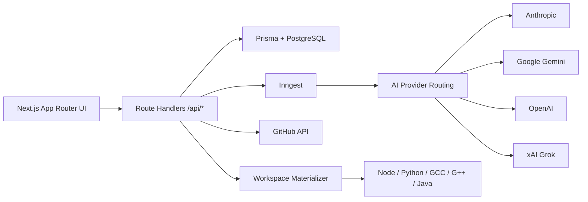

# Torq-AI

Torq-AI is an AI-native coding workspace built on Next.js. It lets users create projects from prompts, edit files with AI assistance, preview and run code, import/export GitHub repositories, and route generation across multiple model providers including Anthropic, Gemini, OpenAI, and xAI Grok.

## Highlights

| Area | What it does |
| --- | --- |
| Project creation | Boots a new workspace from a natural-language prompt |
| AI editing | Supports chat, quick edits, and inline code suggestions |
| File management | Create, rename, delete, and browse files/folders in a project tree |
| Preview and execution | Preview web/text assets and run JavaScript, Python, C, C++, and Java |
| GitHub workflows | Import an existing repository or export a project to a new repo |
| Background jobs | Uses Inngest for async project bootstrap and GitHub operations |
| Model routing | Chooses from Anthropic, Google, OpenAI, and xAI Grok models |

## Stack

| Layer | Technology |
| --- | --- |
| Frontend | Next.js 16, React 19, Tailwind CSS 4, Radix UI |
| Backend | Next.js Route Handlers, Prisma, NextAuth/Auth.js |
| Database | PostgreSQL |
| Jobs | Inngest |
| AI | Vercel AI SDK, Inngest Agent Kit, Firecrawl |
| Execution | Host-side workspace materialization and language runtimes |
| Deployment | Docker + Railway |

## Architecture



### Core execution flow

1. The user creates or opens a project.
2. File metadata and conversation history are loaded from PostgreSQL through Prisma.
3. AI requests are routed through the model catalog and health-aware fallback logic.
4. Long-running work such as repository import/export and project bootstrap runs in Inngest.
5. Preview and run flows materialize the project tree into a temporary workspace on the server.

## Repository layout

| Path | Purpose |
| --- | --- |
| `src/app` | App Router pages and API routes |
| `src/features` | Feature modules for conversations, editor, projects, preview, and AI |
| `src/lib` | Shared server/client utilities, model routing, auth, Prisma access |
| `src/inngest` | Inngest client and function registration |
| `prisma` | Database schema and migrations |
| `tests` | Vitest coverage for critical pure logic |
| `Dockerfile` | Production container used by Railway |
| `railway.json` | Railway config-as-code for Docker deploys and healthchecks |

## Environment variables

Copy `.env.example` to `.env.local` for local development.

### Required

| Variable | Why it matters |
| --- | --- |
| `DATABASE_URL` | Primary Prisma/PostgreSQL connection string |
| `AUTH_SECRET` | Session signing secret |
| `NEXTAUTH_URL` | Public app URL used by Auth.js |
| `INNGEST_EVENT_KEY` | Inngest event publishing key |
| `INNGEST_SIGNING_KEY` | Inngest request verification key |
| One AI provider key | At least one of `ANTHROPIC_API_KEY`, `GOOGLE_GENERATIVE_AI_API_KEY`, `GEMINI_API_KEY`, `OPENAI_API_KEY`, or `XAI_API_KEY` |

### Optional

| Variable | Purpose |
| --- | --- |
| `DIRECT_URL` | Direct database URL for Prisma migrations |
| `GITHUB_ID` / `GITHUB_SECRET` | GitHub OAuth login and repo integration |
| `FIRECRAWL_API_KEY` | URL scraping for richer AI context |
| `SENTRY_*` | Error monitoring and source-map upload |
| `INNGEST_BASE_URL` / `INNGEST_DEV` | Local dev worker tuning |

## Local development

### Prerequisites

| Tool | Recommended version |
| --- | --- |
| Node.js | 20.x |
| npm | 10.x or newer |
| PostgreSQL | 15+ |
| Inngest CLI | Pulled automatically via `npx` in dev |

### Setup

```bash
npm install
cp .env.example .env.local
npm run prisma:generate
npm run prisma:migrate
npm run dev
```

Open [http://localhost:3000](http://localhost:3000).

The `dev` script starts:

- the Next.js app
- the Inngest local dev worker after `/api/inngest` becomes reachable

## Commands

| Command | Description |
| --- | --- |
| `npm run dev` | Start the app and local Inngest worker together |
| `npm run dev:web` | Start only the Next.js app |
| `npm run inngest:dev` | Start the Inngest local dev worker |
| `npm run prisma:generate` | Generate Prisma client |
| `npm run prisma:migrate` | Run development migrations |
| `npm run prisma:deploy` | Apply production migrations |
| `npm run lint` | Run ESLint |
| `npm run test` | Run Vitest |
| `npm run build` | Build the production app |
| `npm run start` | Start the production server |

## AI model support

Torq-AI ships with a model catalog and provider-health checks.

### Included providers

| Provider | Example models |
| --- | --- |
| Anthropic | `claude-sonnet-4-20250514`, `claude-opus-4-1-20250805` |
| Google | `gemini-2.5-flash`, `gemini-2.5-pro` |
| OpenAI | `gpt-5-mini`, `gpt-5.2` |
| xAI | `grok-4`, `grok-4.20-reasoning`, `grok-3-mini` |

### Routing behavior

- The requested model is tried first when available.
- Fallback prefers a healthy model on another configured provider before retrying the same provider.
- `/api/models/health` exposes per-model readiness for the authenticated UI.

## GitHub workflows

### Import

- Accepts standard GitHub HTTPS URLs and SSH-style repo URLs such as `git@github.com:owner/repo.git`.
- Creates a Torq-AI project, clears any existing files, then imports the repository tree.
- Binary files are preserved and text files are stored inline.
- Import now fails loudly if one or more files cannot be created, instead of silently claiming success.

### Export

- Creates a new GitHub repository for the authenticated user.
- Uploads the current project tree as an initial commit.
- Uses normalized project paths to avoid collisions and invalid exports.

## Preview and code execution

### Preview

- HTML and Markdown
- JSON and common text formats
- PDFs
- Images and SVGs

### Runnable file types

- JavaScript via `node`
- Python via `python3`
- C via `gcc`
- C++ via `g++ -std=c++17`
- Java via `javac` and `java`

### Safety notes

- Project item names are normalized and validated before creation or rename.
- Duplicate resolved paths are rejected.
- Parent-child relationships are verified so files cannot be attached to folders from another project.
- Binary files cannot be edited as text.
- Materialized workspace paths are built through a shared safe path resolver to avoid traversal issues.

## Testing and validation

Current repository validation commands:

```bash
npm run lint
npm run test
npm run build
```

The test suite covers:

- project path normalization and duplicate-path protection
- cycle detection in project trees
- GitHub repository URL parsing
- Grok/xAI presence in the AI model catalog

## Deployment on Railway

Railway can deploy this repo directly from GitHub using the included `Dockerfile` and `railway.json`.

### Services you need in Railway

1. One application service linked to this GitHub repository.
2. One PostgreSQL service.

Optional but commonly needed:

1. A custom domain.
2. Shared environment variables for AI providers, GitHub OAuth, Inngest, and Sentry.

### Recommended deployment steps

1. Create a Railway project.
2. Add a PostgreSQL service.
3. Add a GitHub-backed service pointed at `https://github.com/RynTrq/Torq-AI.git`.
4. Set the environment variables from `.env.example`.
5. Set `NEXTAUTH_URL` to the Railway public domain.
6. Set the GitHub OAuth callback URL to `https://<your-domain>/api/auth/callback/github`.
7. Point Inngest production webhooks to `https://<your-domain>/api/inngest`.
8. Deploy and verify `GET /api/health`.

### Railway notes

- Prisma migrations run at container startup via `prisma migrate deploy`.
- Railway healthchecks are configured against `/api/health`.
- The image includes Python, GCC, G++, and Java so server-side run features keep working.

## Troubleshooting

| Symptom | What to check |
| --- | --- |
| Auth login fails | `AUTH_SECRET`, `NEXTAUTH_URL`, and GitHub OAuth callback URL |
| No models available | At least one provider API key must be present and valid |
| GitHub import/export fails | GitHub account must be connected and OAuth scopes must allow repo access |
| Background jobs do not run locally | Confirm `npm run dev` started the Inngest dev server |
| Project run command fails | Confirm the file type is supported or set a project `runCommand` |
| Health endpoint returns degraded | Inspect missing env vars in `/api/health` |

## Recent engineering upgrades

- Added first-class xAI Grok model support and health probing.
- Removed legacy deployment artifacts from the repository.
- Added Railway config-as-code.
- Hardened project path handling against invalid names, duplicate paths, and cyclic trees.
- Enforced parent-folder validation at the data layer.
- Blocked binary files from text-edit APIs.
- Improved request validation on AI editing and GitHub integration routes.
- Added automated tests for critical pure logic.

## Residual risks

- Production deploy validation still depends on real Railway credentials, real environment variables, and reachable external services.
- Some third-party dependency vulnerabilities remain transitive and require upstream or major-version updates; review `npm audit` before production rollout.
- GitHub push/deploy automation requires local Git and Railway/GitHub CLI authentication in the machine where this repo is operated.
